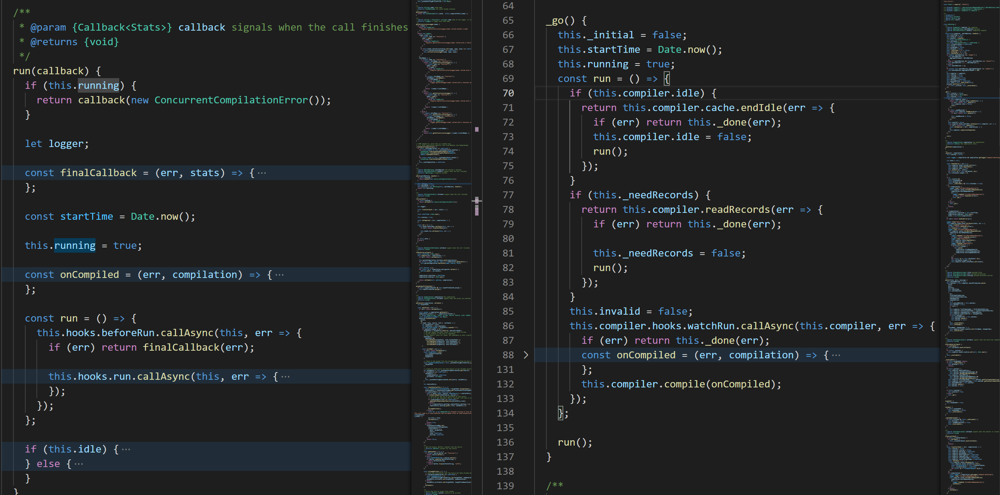

- ## HMR under the hood

  - ### 大纲
    - #### [基本概念](#1)
    - #### [配置使用](#2)
    - #### [核心原理](#3)
    - #### [简单实现](#4)
    - #### [总结](#5)
  - <h3 id="1">基本概念</h3>

    - #### **live reload**

      UI 界面开发过程中，开发人员通常希望程序源代码修改后页面实时刷新(`live reload`), 以便预览；这种效果通过简单的 file watch + runtime injection + push service 可以实现：

      

      这种方式满足基本使用需求，但会导致页面整体刷新、应用状态丢失 ，开发调试效率较为低下。

    - #### **hot reload**

      于是在此基础上，形成了热刷新(`hot reload`)的概念，其核心思想是通过运行时动态注入修改后的文件内容，同时不中断应用正常运行，实现应用状态保存、页面局部刷新，以此提升开发效率。

      

      热刷新的基础是模块热替换(`HMR`), HMR 最开始由 `webpack` 实现支持，能够对运行时的 javaScript 进行更新、替换等操作。

      - [Module Replacement Concepts](https://webpack.js.org/concepts/hot-module-replacement/)

        > Hot Module Replacement (HMR) exchanges, adds, or removes modules while an application is running, without a full reload.

  - <h3 id="2">配置使用</h3>

    - **_[see HMR demo with react](./react-HMR-demo/webpack.config.js)_**

      

    - #### 示例版本
      ```
        "webpack": "~4.40.2",
        "webpack-cli": "^3.3.12",
        "webpack-dev-server": "^3.8.2"
      ```
    - #### 开启配置

      ```javascript
      // 1 webpack-dev-server --inline --hot
      // 2 npm scripts with webpack-dev-server with inline args or webpack config option

      module.exports = {
        // ...
        devServer: {
          inline: true,
          hot: true,
        },
      };
      ```

      - `inline`: 运行时注入相关 WDS client 等模块以实现 reload 等功能；
      - `hot`: 添加 HMR plugin、添`webpack/hot/dev-server`至打包入口、设置 WDS 以 hot 模式运行；

    - #### [常用 API](https://www.webpackjs.com/api/hot-module-replacement/)

      - **_`accept`_**

        > 当前模块接受指定依赖模块更新，并于更新时执行回调函数；

        ```javascript
        // accept(dependencies?:string|string[],callback?:()=>any)
        // dependencies 可为字符串 or 字符串数组
        // callback 为模块更新后执行的回调函数

        if (module.hot) {
          module.hot.accept('./dialog-content', function () {
            render();
          });
        }
        ```

      - **_`dispose`_**

        > 该方法接受一个回调函数，在当前模块被替换时执行回调，可用于模块副作用清除或数据传递

        ```javascript
        // dispose(callback:(data:object)=>any)
        // callback 为当前模块被替换时执行的回调函数

        import { createStore } from 'redux';
        import { createReducer, Action } from './store.js';

        const store = createStore(createReducer);

        // log data
        if (module.hot) {
          if (module.hot.data) console.log(module.hot.data);
        }
        // mount data
        if (module.hot) {
          module.accept();
          module.hot.dispose(function (data) {
            data.state = store.getState();
          });
        }
        ```

      - [更多相关 api 请参看 webpack/hot-module-replacement ](https://www.webpackjs.com/api/hot-module-replacement/)

  - <h3 id="3">核心原理</h3>

    - #### 整体运作流程

      webpack HMR 的整体运作流程如下图所示，其中的关键点有两个：

      - `HotModuleReplacementPlugin`:除去一些代码解析、添加依赖/模板的工作，核心的作用就是为编译更新构建`additionalChunkAsstes`, 即 `manifest` 与 `update file` 两个文件；  
        
      - `HMR runtime`：实现核心的运行时模块增删替换等功能

      

    - #### 模块职能

      - `webpack-dev-server`

        - 根据参数/配置的`inline`、`hot` 选项，将 `webpack-dev-server/client`、`webpack/hot/dev-server` 添加至 `entry`
        - 在`compiler`,`done`等生命周期添加钩子函数，向客户端发送打包状态/信息等
        - 添加 `webpack-dev-middleware`
          - 以 `watch` 模式运行打包流程
          - 替换 comiler `outputFileSystem`，将打包文件输出至内存文件系统
        - 构建应用路由及其他相关操作
        - 启动 http、socket 服务

        

      - `compiler`

        - `webpack` 核心工作流程，提供各种生命周期供插件系统注册执行，并创建 `compilation` 实例，完成编译打包工作；以 `watch` 模式运作时，会监听文件系统，在文件修改时重新执行编译打包流程，下面是简要流程示意

        

        - `watch mode`
          - `DirectoryWatcher`：完成对文件（夹）的监听实现，以及初步监听数据加工
          - `watchpack`：完成触发底层逻辑的封装，实现上层逻辑跟触发逻辑解耦
          - `NodeWatchFileSystem`：完成对监听数据业务逻辑处理，进行最后回调处理
          - `compiler`：完成最终业务响应

        

        

    - `webpack-dev-server/client`

      - `webpack-dev-server/client` 被添加至项目文件入口处，一块打包构成最终的输出 `bundle`, 其主要作用是在客户端向 `webpackDevServer` 发起 socket 连接，对一系列事件实现监听并完成相应功能，详情如下：

        ```javascript

            var socket = require('./socket');
            var reloadApp = require('./utils/reloadApp');

            var status = {
              isUnloading:false,
              currentHash:''
            }

            var options = {
              hot:false,
              liveReload:false
              // ...
            }

            var onSocketMessage = {
              hot(){} // 设置 options.hot, 后续以热更新模式运作
              liveReload(){} // 设置 options.liveReload, 实时刷新页面
              hash(){} // 接受新的构建hash，更新currentHash
              invalid(){} // app已更新，重新编译中
              ok(){} // 新的资源构建完毕，触发reloadApp动作
              'content-changed':(){} // 直接触发整体更新

            }

            socket(socketUrl, onSocketMessage)

            // utils/reloadApp

            function reloadApp(options,status){
              if(options.hot){
                var hotEmitter = require('webpack/hot/emitter');
                hotEmitter.emit('webpackHotUpdate', status.currentHash);
              }else if(options.liveReload){
                // naive for simplicity
                window.location.reload()
              }
            }

        ```

    - `webpack/hot/dev-server`

      - 本质上就是一个额外添加的 `module`, 监听更新消息，并调用 HMR api 触发模块更新

        ```javascript
        var lastHash;
        var hotEmitter = require('./emitter');
        function upToDate() {
          return lastHash.indexOf(__webpack_hash__) >= 0;
        }
        function check() {
          module.hot.check(true).then(function (updatedMoudles) {
            if (!upToDate()) check();
          });
        }
        if (module.hot) {
          hotEmitter.on('webpackHotUpdate', function (currentHash) {
            lastHash = currentHash;
            check();
          });
        }
        ```

    - `HotModuleReplacementPlugin`
      

      - `HotModuleReplacementPlugin` 主要作用于`compilation`实例生成后的阶段，其主要工作有：

        - 在 `mainTemplate` 工作流上对 `bootstrap`,`moduleObj`, `moduleRequire` 等事件进行监听以生成 HMR runtime 代码

          ```javascript
          // bootstrap
          mainTemplate.hooks.bootstrap.tap(
            'HotModuleReplacementPlugin',
            (source, chunk, hash) => {
              // ...
              return Template.asString([
                source,
                '',
                hotInitCode, // inject HotModuleReplacement.runtime.js responsible for HMR main workflow
                // ...
              ]);
            }
          );

          // moduleObj
          mainTemplate.hooks.moduleObj.tap(
            'HotModuleReplacementPlugin',
            (source, chunk, hash, varModuleId) => {
              return Template.asString([
                `${source},`,
                `hot: hotCreateModule(${varModuleId}),`, // creates hot apis: accept, dispose etc
                'parents: (...)',
                'children: []',
              ]);
            }
          );

          // moduleRequire
          mainTemplate.hooks.moduleRequire.tap(
            'HotModuleReplacementPlugin',
            (_, chunk, hash, varModuleId) => {
              return `hotCreateRequire(${varModuleId})`; // require wrapper builds runtime module replationship
            }
          );
          ```

        - 监听 `record` 事件，存储 `compilation`,`module`,`chunk` hash

          ```javascript
          compilation.hooks.record.tap(
            'HotModuleReplacementPlugin',
            (compilation, records) => {
              if (records.hash === compilation.hash) return;
              records.hash = compilation.hash;
              records.moduleHashs = {};
              for (const module of compilation.modules) {
                const identifier = module.identifier();
                const hash = createHash(compilation.outputOptions.hashFunction);
                module.updateHash(hash);
                records.moduleHashs[identifier] = hash.digest('hex');
              }
              records.chunkHashs = {};
              for (const chunk of compilation.chunks) {
                records.chunkHashs[chunk.id] = chunk.hash;
              }
              records.chunkModuleIds = {};
              for (const chunk of compilation.chunks) {
                records.chunkModuleIds[chunk.id] = Array.from(
                  chunk.modulesIterable,
                  (m) => m.id
                );
              }
            }
          );
          ```

        - 监听 `additionalChunkAssets` 事件，遍历 `modules`，`chunkHashs`，对比 `record` 保存的 hash 寻找出增减模块，据此生成 `hotUpdateMainContent(manifest)`, `hotUpdateChunkTemplate(update file)`文件(_ps:deprecated on webpack5_)

          ```javascript
          compilation.hooks.additionalChunkAssets.tap(
            'HotModuleReplacementPlugin',
            () => {
              // ...
              for (const module of compilation.modules) {
                // ...
              }
              const hotUpdateMainContent = {
                h: compilation.hash,
                c: {},
              };
              for (let chunkId of Object.keys(records.chunkHashs)) {
                // ...
              }
            }
          );
          ```

    - `HotModuleReplacement.runtime`  
      `webpack/hot/dev-server` 接收到 `webpackHotUpdate` 消息时开始检查当前是否需要检查更新，确认后展开 `check` 流程，流程的关键环节为 runtime 中实现的 `hotCheck` 与 `hotApply` 这两个方法，前者在通过 `hotDownloadMainfest` 方法，通过 ajax 方式获取本次编译生成的 hash 以及发生更新的 `chunk` 集合，随后通过`hotDownloadUpdateChunk`方法以 jsonp 方式下载发生更新的`chunk`。  
      
      获得需要更新的模块内容后，随后进入模块更新替换的流程，核心是`hotApply`方法，在其内部通过对待更新模块的遍历及其模块关系的回溯构建起一个`update chain`:
        
      回溯的过程是一个冒泡的过程，当一个模块的更新未被接收，则更新流程通过其被引用关系上移，直至根模块，此时整个更新流程以`abort`状态中止，重新 reload。
      

  - <h3 id="4">简单实现</h3>

    - **_[see naive HMR implementation](./naive-HRM-demo/webpack.config.js)_**
    - 实现功能
      - 提供 http 及 socket 的服务的 `devServer` 及其 `client runtime` **[./naive-HRM-demo/server.js](./naive-HRM-demo/server.js)**
      - 负责更新文件生成及 HMR runtime 注入的 `NaiveHotModuleReplacementPlugin` **[./naive-HRM-demo/webpack.config.js](./naive-HRM-demo/webpack.config.js)**
      - 提供 `accept` api 等功能的 `HMR runtime` **[./naive-HRM-demo/client/HMR-runtime.js]('/naive-HRM-demo/client/HMR-runtime.js)**
      - ...

  - <h3 id="5">总结</h3>

    `hot reload` 的核心理念是期望在应用程序运行的过程中对其组成功能模块完成替换更新，就 webpack 实现的 HMR 而言，其实现的核心还是基于其打包运作流程构建起的模块依赖关系图的开发运用，这其中包含了从本地运行服务到客户端运行时等的一系列环节；而其背后还有如代码分析转换、模块关系组合/依赖处理乃至与之结合运作的各类框架背后的运作原理等细节内容，这篇分享并未就其中每一个细节都展开讨论，这里仅其一个抛砖引玉的作用，想了解 HMR 的更多底层细节及其他应用的实现，去阅读相关的源码是不错的选择，而此次分享中上述的一些背后细节，会在后续的分享中展开讨论，敬请期待。

  - <h3>Q&A</h3>

    - hmr 模式下 Runtime 是怎么加上 HMR Runtime 代码的。

    - 业务代码并没有打包 socketjs，hot 代码的，浏览器为什么会有这些代码的。

    - 浏览器是如何判断并下载如：501eaf61104488775d2e.hot-update.json,。501eaf61104488775d2e.hot-update.js 文件的，并且如何将 js 内容替换应用程序的内容。

    - 编译器如何监听资源文件的变化，并将改动的文件输出到 Server 里面供客户端下载,如 501eaf61104488775d2e.hot-update.json,0.501eaf61104488775d2e.hot-update.js。

    - 服务器如何监听编译器的生命周期，并在其编译开始，结束的时候，向浏览器发送 socket 信息。

    - 浏览器替换新的 module 之后，如何及时清理缓存。
